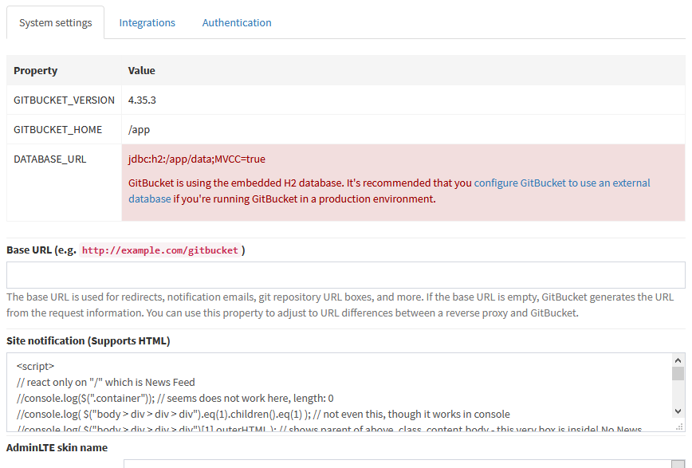
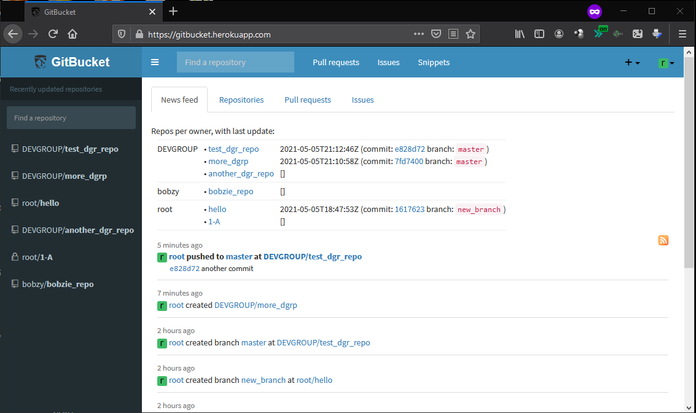

# gitbucket-overridenewsfeed

## Introduction

This is not a plugin, but a demonstration of JavaScript.

Open the file [`gitbucket-overridenewsfeed.js`](gitbucket-overridenewsfeed.js) in this repo, copy its contents, and then paste in your GitBucket installation settings (4.35.3 says "System Settings/Site notification (Supports HTML)", earlier versions said "System Settings/Information (Supports HTML)" or "System Settings/General Settings/Information"):



Then, when you return to your GitBucket installation home/landing page, you should see an extra table at the News Feed:



## Background

From [customizing the main page · Issue #1136 · gitbucket/gitbucket · GitHub](https://github.com/gitbucket/gitbucket/issues/1136), there is no current way to customize the main page in GitBucket.

In GitBucket at least from 4.33.0 and up to 4.35.3, the main/landing page for a user (after login):

* by default shows the tabs of what the `gitbucket` software calls Dashboard, and
* by default, the first leftmost tab of the Dashboard tabs, called "News Feed", is selected - and below it shows a historic list of what the `gitbucket` software calls Activities.

In [src/main/twirl/gitbucket/core/index.scala.html at 4.35.3](https://github.com/gitbucket/gitbucket/blob/4.35.3/src/main/twirl/gitbucket/core/index.scala.html):

```
...
    @gitbucket.core.dashboard.html.tab()
    <div class="container">
      <div class="pull-right">
        <a href="@context.path/activities.atom"></a>
      </div>
      @gitbucket.core.helper.html.activities(activities)
    </div>
...
```

... there are calls to:

* `@gitbucket.core.dashboard.html.tab()` - likely defined by [tab.scala.html (at 4.35.3)](https://github.com/gitbucket/gitbucket/blob/4.35.3/src/main/twirl/gitbucket/core/dashboard/tab.scala.html)
* `@gitbucket.core.helper.html.activities(activities)` - likely defined by [activities.scala.html (at 4.35.3)](https://github.com/gitbucket/gitbucket/blob/4.35.3/src/main/twirl/gitbucket/core/helper/activities.scala.html)

There are several ways to address this:

* Change  `index.scala.html` (likely not doable by a plugin) - either make the `activites()` call conditional, or insert a new call before it
* Change `activities.scala.html` and related code (likely not doable by a plugin) so it outputs something else
* Add a new leftmost tab to the Dashboard tabs, with a new template, and make it the default (however, that still doesn't change that the `activities()` call in `index.scala.html` is unconditional, and will output regardless)

For GitBucket plugins, see http://gitbucket-plugins.github.io/ and https://gitbucket.github.io/gitbucket-news/gitbucket/2015/06/29/how-to-create-plugin.html

GitBucket plugin hooks can be seen in [PluginRegistry.scala (at 4.35.3)](https://github.com/gitbucket/gitbucket/blob/4.35.3/src/main/scala/gitbucket/core/plugin/PluginRegistry.scala).

There we can see, that there are hooks for `addDashboardTab` and `getDashboardTabs`; so we can in principle change the dashboard tabs from a plugin, but it seem we cannot prepend anything else and make it first.
There seem to be otherwise no hooks containing `activi`ties in the name in the PluginRegistry.

See: [using twirl as runtime template engine](https://groups.google.com/g/play-framework/c/zopu-RXHHm4)

>  I was considering an approach where I somehow used twirl to compile the templates on the fly to generate scala code and then also evaluate this scala code on the fly to create the final output.
>
> Generating scala code and "evaluating" it (by that, you mean compiling then executing) is certainly possible, but not very sensible.  The scala compiler is very slow - just look at a scala projects build times compared to a java app.  That said, if you're able to cache the compilation, then it's not so bad.

So, the only immediate way (without changes to GitBucket itself) is to use JavaScript - as hinted in [customizing the main page · Issue #1136 · gitbucket/gitbucket · GitHub](https://github.com/gitbucket/gitbucket/issues/1136) ...
